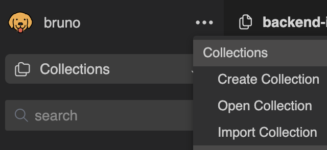

# Luma Technical Interview

## Documentation

### Technologies Used

- [Node.js](https://nodejs.org/) is a free, open-source, cross-platform JavaScript runtime environment that lets developers create servers, web apps, command line tools and scripts;
- [TypeScript](https://www.typescriptlang.org/) is a strongly typed programming language that builds on JavaScript, giving you better tooling at any scale;
- [Express.js](https://expressjs.com/) is a fast, unopinionated, minimalist web framework for Node.js;
- [Mocha](https://mochajs.org/) Mocha is a feature-rich JavaScript test framework running on Node.js and in the browser;
- [Chai](https://www.chaijs.com/): Chai is a BDD / TDD assertion library for node and the browser that can be delightfully paired with any javascript testing framework;
- [pnpm](https://pnpm.io/) is a fast, disk space efficient package manager;
- [Docker](https://www.docker.com/) is a set of platform as a service products that use OS-level virtualization to deliver software in packages called containers;
- [Docker Compose](https://docs.docker.com/compose/) is a tool for defining and running multi-container Docker applications;
- [ESLint](https://eslint.org/) statically analyzes your code to quickly find problems;
- [Prettier](https://prettier.io/) is an opinionated code formatter with support to many languages that integrates with most editors;
- [Bruno](https://usebruno.com/) is a Git-integrated, fully offline, and open-source API client.

### Running the project

To run the API, you have two options: use Docker Compose or running it directly without Docker.

#### Using Docker Compose

1. Ensure you have Docker and Docker Compose installed on your machine.
2. Build and start the containers:
    ```sh
    docker-compose up --build
    ```
3. The API should now be running and accessible at `http://localhost:3000`.

#### Running Without Docker

1. Ensure you have [Node.js](https://nodejs.org/) and [pnpm](https://pnpm.io/) installed on your machine. Refer to the node version in [.nvmrc](./.nvmrc):
2. Install the dependencies:
    ```sh
    pnpm install
    ```
3. Start the API:
    ```sh
    pnpm start
    ```
4. The API should now be running and accessible at `http://localhost:3000`.

### Testing the API

#### Parameters

The API exposes a two edges `POST /waitlist` and `GET /health`. The later is just a simple health check and can be ignored. The former has the following `body` parameters that can be changed:

- `count`: total number of prospect patients that will be returned;
- `lowBehaviorCount`: number of prospect patients that will be randomly moved to the top of the waitlist;
- `facility`: Geographical coordinates (latitude and longitude) of a facility;
- `averageLowBehaviorThreshold`: threshold value for what is considered "low behavior." It uses the average score of a given behavior score. Example: with a `averageLowBehaviorThreshold` of 1 any value bellow average is considered low behavior, while with a `averageLowBehaviorThreshold` of 0.5 bellow half that will be considered instead;
- `debug`: makes so that the patients also include the computational values used to calculate the final score within the waitlist.

For examples, see the sections below: [Using Bruno](#using-bruno) and [Using cURL](#using-curl).

#### Using Bruno

1. Make sure you are running the application. Refer to the [Running the project](#running-the-project) section.
2. Open [Bruno](https://usebruno.com/) and create a `Open Collection`.
   
3. Select the `POST waitlist` Request:
4. Send the request and verify the response.

#### Using cURL

Alternatively you can use curl from within your terminal:

```sh
curl --request POST \
  --url http://localhost:3000/waitlist \
  --header 'content-type: application/json' \
  --data '{
  "count": 10,
  "lowBehaviorCount": 1,
  "facility": {
	"latitude": "-32.6156",
	"longitude": "131.6695"
  },
  "averageLowBehaviorThreshold": 0.3,
  "debug": true
}'
```

## Specification

In this section you can find the original specification for the Backend Interview

### Problem Definition

A busy hospital has a list of patients waiting to see a doctor. The waitlist is created sequentially (e.g. patients are added in a fifo order) from the time the patient calls. Once there is an availability, the front desk calls each patient to offer the appointment in the order they were added to the waitlist. The staff member from the front desk has noticed that she wastes a lot of time trying to find a patient from the waitlist since they&#39;re often not available, don&#39;t pick up the phone, etc. She would like to generate a better list that will increase her chances of finding a patient in the first few calls.

### Interview Task

Given patient demographics and behavioral data (see sample-data/patients.json), create an algorithm that will process a set of historical patient data and compute a score for each patient that (1 as the lowest, 10 as the highest) that represents the chance of a patient accepting the offer off the waitlist. Take in consideration that patients who have little behavior data should be randomly added to the top list as to give them a chance to be selected. Expose an api that takes a facility's location as input and returns an ordered list of 10 patients who will most likely accept the appointment offer.

### Weighting Categories

Demographic

- age (weighted 10%)
- distance to practice (weighted 10%)

Behavior

- number of accepted offers (weighted 30%)
- number of cancelled offers (weighted 30%)
- reply time (how long it took for patients to reply) (weighted 20%)

### Patient Model

- ID
- Age (in years)
- location
    - Lat
    - long
- acceptedOffers (integer)
- canceledOffers (integer)
- averageReplyTime (integer, in seconds)

### Deliverables

The core logic of the code should be written as a Node.js as a library that anyone can import and use. There should also be an API endpoint exposed to run your solution. It should contain documentation and unit tests that show your understanding of the problem. Once you&#39;re finished, submit a PR to this repo.
